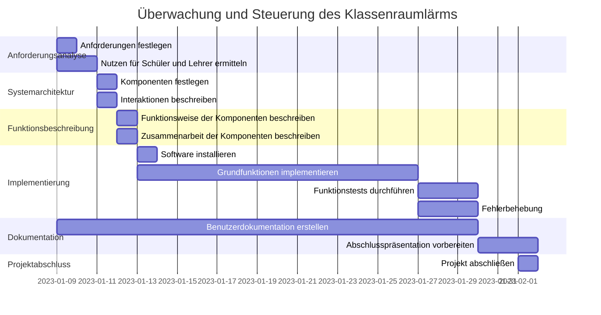

```mermaid
gantt
    title Überwachung und Steuerung des Klassenraumlärms
    dateFormat  YYYY-MM-DD
    section Anforderungsanalyse
    Anforderungen festlegen              :des1, 2023-01-09, 1d
    Nutzen für Schüler und Lehrer ermitteln    :des2, 2023-01-09, 2d

    section Systemarchitektur
    Komponenten festlegen           :des3, 2023-01-11, 1d
    Interaktionen beschreiben        :des4, 2023-01-11, 1d

    section Funktionsbeschreibung
    Funktionsweise der Komponenten beschreiben  :des5, 2023-01-12, 1d
    Zusammenarbeit der Komponenten beschreiben  :des6, 2023-01-12, 1d

    section Implementierung
    Software installieren          :des8, 2023-01-13, 0.5d
    Grundfunktionen implementieren :des9, 2023-01-13, 2w
    Funktionstests durchführen    :des10, 2023-01-27, 3d
    Fehlerbehebung                :des11, 2023-01-27, 3d

    section Dokumentation
    Benutzerdokumentation erstellen :des12, 2023-01-09, 3w
    Abschlusspräsentation vorbereiten :des13, 2023-01-30, 3d

    section Projektabschluss
    Projekt abschließen           :des14, 2023-02-01, 1d
```
